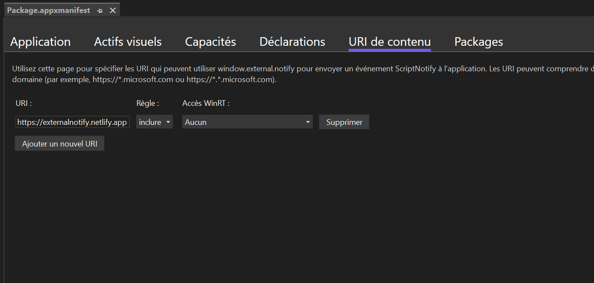

# external-notify
Full demo code for external notify to communicate between a web page and an UWP/WAP WebView

## Demo website

The demo website is hosted at the following address :

https://externalnotify.netlify.app/

This hosting permits to easyly try window.external.notify in an UWP/WAP project.

You just needs to add this address to `ApplicationContentUriRules` section of your app's appxmanifest file.
